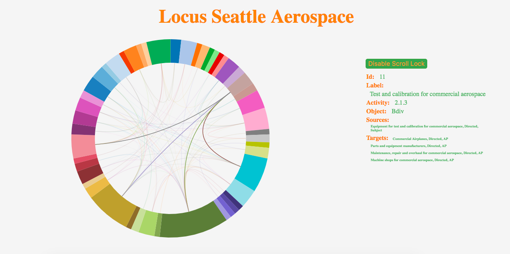

## General Description

[Locus Visualization](https://zhuo-ch.github.io/misc/) is a visualization app based off of Seattle's Aerospace data from conception to implementation. The goal is to present the data in a way that easy to digest while ensuring a great user experience.

## Features

- Single pie chart with sections representing nodes scaled to represent the amount of activity for the particular node in relation to other nodes.

- Ribbons representing edges correlating to a source to target relationship and vice versa.

- Hovering over pie chart sections will bring up detailed information about the node including a list of all relationships.

- Hovering will also "highlight" the current node an target relationships so users can quickly and easily pick out the most pertinent information.

- Clicking on a node will lock the screen to that node so users can safely view datum. Clicking anywhere on chart or on the "remove scroll lock" button will reengage the hover mechanism.

## Development

- The current version is actually the second iteration for the app. The initial version of the app featured "bubbles" randomly placed with lines representing relationships. This was done in Canvas with the intention of building a rotatable 3D matrix. However, initial implementation quickly showed that anything more than 20 or so nodes would be too confusing to users.

- The final live implementation was developed with the knowledge that a "spiderweb-like" matrix from the first iteration would be the best way to easily show users relationships between the nodes. However, the nodes themselves needed to be presented in a much more organized manner. A pie chart was used as it can be used to display nodes as well as an additional piece of information - each nodes' activity relative to other nodes.

## Technology

- D3.js is the primary library used for this visualization, handling the bulk of the data, data-binding, SVG generation, and listeners.

- NPM, Webpack, Babel were used as build tools for package handling, module bundling, and transcompiling (this app is written mainly in ES6).

- Lodash and XLSX are used as quality of life tools to easily merge data as well as easily read spreadsheet data.

- The actual visualization utilizes SVG for its synergy with D3.js. However, later iterations of the app may switch to Canvas if the data set is scaled up.

## Issues

- While my first inclination after seeing the size of the data sets to be handled was to use Canvas. However, I ultimately decided that although SVG can become very processor intensive with larger data sets, most systems would be able to handle the current data size and SVG's synergy with D3.js would ultimately make for a faster turn around time for the project.

- Although "d3.chords()" can be used to turn a matrix of relational data into chords that are used by "d3.ribbon()" to generate relational ribbons, this function leaves out datum that does not have relationships. In an effort to have all data represented, "Chart.genChords()" was implementated instead.

- Similarly, while XLSX is useful for reading data from spreadsheets, parsing is done with "Util.parseNodes()."

## Todos

- Change from SVG to Canvas. Although SVG was chosen (primarily for speed), this app will have to use Canvas if the data set scales up.

- Refactor parsing functions. Parsing functions are currently highly specific to the data set used. The first refactor of the code base will focus on generalizing these functions for different data sets.
